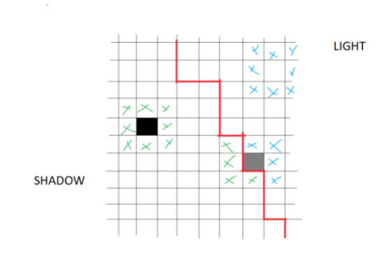
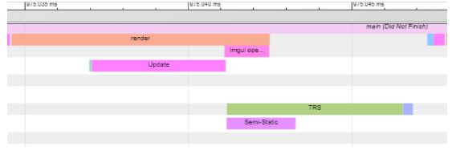
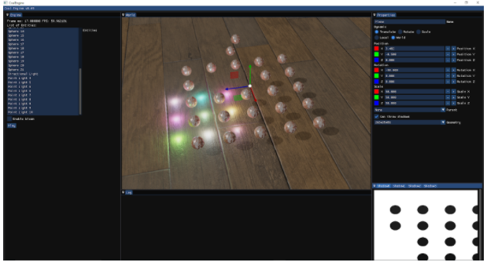
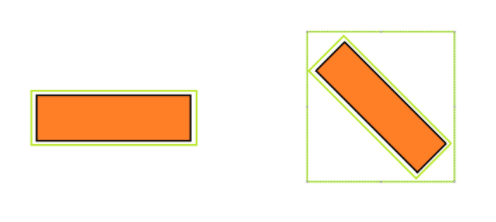

Collaborators:  
-Aníbal Simarro Garrido  
-Alejandro Sánchez Gimeno  

Youtube Video:
https://www.youtube.com/watch?v=LhTw2rLMN68

# CoalEngine

## 1. Introduction

For the project of this subject, we are going to create a graphics engine using the C++ programming language and the OpenGL3 graphics API, our engine a priori includes the following characteristics:
 
-Multi-threading engine. 
-Forward render. 
-Deferred render. 
-Entity-Component-System based. 
-Lua Scripting. 
-PBR & Pong Illumination (Spot, Point and Directional Lighting). 
-DisplayList implementation (Draw Task Queue). 
-Post-Process Effects (Bloom, Gray Scale, Blur...). 
-Shadows. 
-OBJ Loader. 
-FrontEnd User Interface. 

## 2. Implemented techniques.

### 2.1 ECS.

The ECS system arises from the techniques of "component-oriented programming", it is an object management system within a graphics engine that is based on three concepts:
-Entity: It is the beginning of the system, the objects of the engine are entities and in them are all the characteristics that these must exert. 
-Component: The components are associated to the entities and these allude to all the functionality that an entity can have.
-System: The systems provide the execution components, that is to say, they are in charge of carrying out all the operations and calculations that the components need.

Some examples of components that we have realised in the engine are the following:

-WorldComponent. This is the component that provides an entity with position, rotation and scaling in the world.
-LocalComponent. This is a component that endows an entity with the ability to have a parent and to apply local transformations to it.
-TRSComponent. It gives an entity the ability to be a dynamic object in the engine and at the same time update its position, rotation and scale matrix in real time.
-RenderComponent. Endows an entity with the ability to associate a drawing geometry to it.
-LightComponent. Allows an entity with the ability to generate light (point, spot or directional).

The implemented ECS system is able to work in multi-threading because each time an entity or component is created, it is created in a particular and safe memory space and then moved to the main memory space at the end of the frame.

### 2.2 DisplayList.

To execute the painting tasks, we have developed a task system called "displaylist" which executes all the painting operations.

A displaylist consists of a number of simple paint commands (ClearScreen, DrawAllEntities, DrawSkybox, ApplyPostProcess...), once the displaylist is finished, it is sent to the renderer to be queued for execution.

The engine creates different displaylists to execute different tasks:

-DisplayList of shadows. It is in charge of making the pre-passes of shadows for the scene.
-Scene DisplayList. In charge of drawing the main scene.
-Front-end DisplayList. In charge of drawing the user's Front-end made with Imgui. 

The displaylists are created in a special memory space protected from the execution of the main ones, and then sent to the main one at the end of the frame. This allows the commands to be executed in multi-threading.

### 2.3 Shadow mapping.

To create shadows within our engine we have relied on framebuffer techniques which allow us to render scenes and generate textures. To execute the shading we have created a displaylist for each shadow we want to render and associate a different framebuffer to each one. The projection to generate the shadows is done in perspective (Sport Light) or orthogonal (Directional Light) always from the position and direction of the light to be rendered. There are no shadows for spotlights. Our engine supports multiple shadows at a time, but currently the maximum number is capped at 4 (it could be increased with no performance lost)

For each pass of each shadow, we look to see if the objects in the scene cast shadows or not, if so they are rendered (using the Depth Map) and generate the final texture. Once the final texture has been created, it is used later when rendering the final scene.

Once the shadow map is obtained, it is used in the shader to capture the shadows. For this we have two different functions (spot and directional), the shadow calculations are the same, but the method of obtaining the direction of the light is different due to the nature of the lights. Regarding the calculation, the first step would be to check if the current fragment is in shadow or not, for this we have to transform the position of the fragment of the light from clipping space to NDC (normalized device coordinates), once this is done, we multiply it by 0.5 and we add another 0.5 to place the values within the range (0,1).

Once the coordinates are projected, we use it to check the depth of that fragment in the shadow map, that will be the smallest depth from the perspective of light. We also obtain the depth value of the fragment and compare them. If the current fragment is greater than the closest fragment of the shadow map, that fragment will be shadowed.

In order to get rid of the shadow acne, an effect produced by the limited resolution of the shadow map, we apply a small offset (usually called bias). The bias varies depending on the angle of the light, if the light is perpendicular the bias will be small and will increase as the angle approaches zero.We adjusted the bias value to minimize the impact of the peter panning. 
To avoid self shadowing, we cull the front faces during the calculation of the shadow map, then the back faces are culled again as usual.

To improve the quality of the shadows we apply PCF (percentage-closer filtering) this technique consists of evaluating not only the current fragment, but also those around it, once all these values have been achieved, an average is made between all and it is obtained the value of the final fragment. This technique is more expensive, since you have to iterate more fragments, but it produces a smoothed result of the shadows.

### 2.4 Scripting.

To help the user to create scenes dynamically, a scripting abstraction layer has been implemented, where the user only has to use the functionality we provide.

The scripting has been done with Lua, which is a simple and low-difficulty high-level language. The project compiles the entire Lua library for use.

### 2.5 PBR.

PBR or physical based rendering is a physics-based lighting technique, it follows a BRDF (bidirectional reflectance distribution function) model. To do this, it follows several fundamental principles:

- Energy conservation
- Micro-facet model
- model metal vs. non- metal (dielectric) surfaces
- fresnel effect.

conservation of energy: the sum of all the energy that is refracted and reflected can never be greater than the energy coming from the light itself

microfacets: the rougher a surface is, the light rays bounce in totally different directions, while the smoother a surface is, the greater the probability that the reflected rays will go in the same direction.

metallic surfaces behave differently than non-metallic (dielectric) surfaces. Metal surfaces follow the same principles of refraction and reflection, but all refracted light is absorbed without scattering, this means that metal surfaces only produce specular light but not diffuse light.

The BRDF, or bidirectional reflective distribution function, is a function that calculates the contribution of each ray of light to the light reflected from an opaque surface given its properties. It is made up of three different equations, the normal distribution function, the geometry function and the fresnel equation.

- NDF: approximates the amount of microfacets that are aligned with the halfway vector, taking as input the roughness of the surface.

- Geometry function: describes the self-shadowing of a surface, when the roughness value of a surface is high, microfacets can produce a shadow between them, reflecting less light.

- Fresnel: calculates the reflection of light depending on the viewing angle, if the angle is close to zero, more light will be reflected, if a surface is viewed perpendicularly, less reflected light will be seen.

To implement PBR in the engine we follow the tutorial https://learnopengl.com/PBR/Lighting, as well as the BDRF formulas.

First we extract the values of color, metallic, roughness and ambient occlusion from the textures of the material. Then we obtain the normals of a normal map. For this we also use an algorithm based on this tutorial that calculates the tangents and from them the TBN matrix.

Once all that is obtained, we obtain other data such as the direction of the light, and the view of the observer.

We calculate the reflectivity base of the material, for them an interpolation is made between the albedo color and a fixed value (0.04, a common base for dielectric materials). The closer the metallic value is to 1, the base reflectivity approaches the albedo value, if the metallic is zero, the base stays at 0.04.

Then we calculate the halfway vector and the distance of the light with respect to the fragment. This helps us to calculate the attenuation of the light (quadratic in this case).

Once this is done, we apply Cook-Torrance BRDF with the formulas mentioned above, thus we obtain the specular value of the light. To obtain the diffuse value we subtract from 1.0 the value obtained with the fresnel equation, since as we have said before, the principle of conservation of energy must be preserved, therefore it cannot exceed the value of 1, since it will be more energy than that coming from the light source.

Once this diffuse value is obtained, we subtract the value of the metallic. This helps us to eliminate the diffuse value in the metallic components, since as we have said before, due to their behavior in light, they absorb all the refracted rays and do not have diffuse light. The higher the metallic value, the less diffuse light, if the metallic value is zero, the diffuse light will remain intact.

Finally, it would only be necessary to add the ambient value to the radiance value previously calculated, apply the tone mapping and gamma correction.

### 2.6 Multi-Threading

Using the px_sched task management library, we have performed the multi-threading tasks within our engine.

The engine uses the multi-threading environment to perform the following operations:
 
-Multiple texture loading. 
-Parallelise the render task with the displaylist processing task. 
-Parallelise the render task with the user update. 
-Parallelise the render task with the ECS systems update task. 
-Parallelise ECS tasks with each other. 

Using tracing tools we get the following result from a frame of the engine:

**The green bar in the example (in front of the update task) is the displaylist processing task.

### 2.7 Front-End User.

To improve the user experience, we have used the ImGui library (in its docking variant) and the ImGuizmo library to develop a small Front-End to simplify basic tasks of the engine. These tasks are: 
-Display the scene graph with all entities. 
-Pause or Resume the user Update. 
-Dealing with entity components: World, Local, TRS, Render and Light. 
-Assign parent to an entity. 
-Move, Scale and Rotate an entity in World Space and Local Space with gizmo. 
-Adding new components to entities. 
-View the shadow textures generated by each light source (maximum 4). 
-Rename an entity. 

Result:

The user Front-End is resource consuming, so it is only used for user support, you can toggle between the Front-End view and the final result by pressing the F11 key.

### 2.8 3D Picking.

In order to provide the user with more freedom and fluidity when creating scenes, we implemented a 3D picking system. This allows the user to select the entity they want, either to move, scale or rotate it with the help of the gizmos or to add components or modify some of its properties.

In order to achieve this we use two systems: ray casting and axis aligned bounding boxes (AABB).

As for the ray casting part, when the user clicks anywhere on the screen, we use that position on the screen to cast the raycast. First we pass the coordinates to NDC (normalized device coordinates) dividing by the width and height of the screen, and setting the z coordinate to 1.0.

Then we go to homogeneous clip coordinates, transforming the ray to a vec4, leaving the homogeneous component at 1.0 and the z component at -1.0. To change to camera coordinates we multiply the vector by the inverse of the camera projection.

Same procedure to move to world coordinates, we multiply the vector by the inverse of the camera view. Once all these calculations have been made, we already have the raycast that would go from the position of the camera to the mouse in world coordinates.

But now we need to know if that raycast has intersected with any entity. Here the AABB comes into play. Each entity has an AABB associated with its geometry. The AABB is made up of six floats, corresponding to the value of the six planes aligned to the axis that form the bounding box; the information on the position of the corners is also stored.

Every time a geometry is created, a bounding box is calculated that fits the geometry, finding the largest and smallest value for x, y, z. Once the bounding box is generated, we are ready to calculate intersections. But what happens if we rotate an object? Every time an object's rotation changes, a new bounding box is recalculated based on the rotated bounding box.

With everything ready, we can proceed to calculate the intersections. For this we use the Min / Max algorithm that calculates the minimum and maximum distance of the intersection points. If the maximum distance is less than zero it means that it has intersected but we are within the intersected object, if the minimum distance is greater than the maximum it means that there is no intersection, in all other cases, we are left with the minimum distance as the distance to the point of intersection.

It would only be necessary to iterate over all the entities and check with how many of them the raycast has intersected, if there is more than one, we are left with the one with the shortest distance.

We chose this system as it seemed to us the simplest and most optimal of all, despite the fact that bounding boxes do not always adjust or occupy more space than certain geometries with certain rotations. Calculating the intersection with all the triangles of the geometry was not an option for us since it would be very expensive and the difference would not be so decisive.

## 3. Development Tasks.

Both developers have been involved in every feature implemented within the engine in an active or passive way, either by developing the technique to be implemented, correcting bugs or applying improvements. Nevertheless, we describe the tasks that have been carried out by the developers:
 
-Engine Core (Materials, Geometries, DisplayList, Textures). Alejandro Sachez and Anibal Simarro. 
-ECS. Anibal Simarro supported by Alejandro Sanchez. 
-Frame Buffers.  Alejandro Sachez and Anibal Simarro. 
-PBR Illumination / Material. Alejandro Sanchez supported by Anibal Simarro. 
-Deferred shading. Alejandro Sanchez supported by Anibal Simarro. 
-PostProcess. Alejandro Sanchez supported by Anibal Simarro. 
-Multi-Threading tasks. Anibal Simarro supported by Alejandro Sanchez. 
-FrontEnd (ImGui & ImGuizmo). Anibal Simarro supported by Alejandro Sanchez. 
-Shadow Mapping. Alejandro Sachez and Anibal Simarro (with Alejandro Sanchez improvements and polish). 
-Lua Scripting. Anibal Simarro supported by Alejandro Sanchez. 
-OBJ Loader. Anibal Simarro supported by Alejandro Sanchez. 
-3D picking. Alejandro Sanchez  supported by Anibal Simarro. 

## 4. References, Bibliography and Special Thanks.

To support us in the development we have used multiple sources throughout the project, the most important and noteworthy of which have been the following: 
Principal OpenGL Documentation: 
http://docs.gl/   
https://www.khronos.org/opengl/   

Engine Core (Materials, Geometries, DisplayList, Textures).  
http://www.opengl-tutorial.org/   
https://learnopengl.com/   
Jose Luis Hidalgo slides -3PVG - ESAT.  
ECS.  
Jose Luis Hidalgo slides -3PVG - ESAT.  
Unity Data Oriented Approach to Using Component Systems:  https://www.youtube.com/watch?v=p65Yt20pw0g  
Frame Buffers.  
https://learnopengl.com/Advanced-OpenGL/Framebuffers  
http://www.opengl-tutorial.org/intermediate-tutorials/tutorial-14-render-to-texture/   
 https://open.gl/framebuffers   
Jose Luis Hidalgo slides -3PVG - ESAT.  
 
PBR Illumination / Material.  
https://learnopengl.com/PBR/Lighting  
Deferred shading.  
https://learnopengl.com/Advanced-Lighting/Deferred-Shading  
Jose Luis Hidalgo slides -3PVG - ESAT.  
 
PostProcess.  
https://learnopengl.com/Advanced-Lighting/Bloom  
https://learnopengl.com/Advanced-OpenGL/Framebuffers  
Jose Luis Hidalgo slides -3PVG - ESAT.  
Multi-Threading tasks.   
Jose Luis Hidalgo slides -3PVG - ESAT.  
Shadow Mapping.  
https://learnopengl.com/Advanced-Lighting/Shadows/Shadow-Mapping  
http://www.opengl-tutorial.org/intermediate-tutorials/tutorial-16-shadow-mapping/  
3D picking  
https://gdbooks.gitbooks.io/3dcollisions/content/Chapter3/raycast_aabb.html  

Special thanks to all the external libraries we have used in the project:  

-Multi-Threading -> px_sched : https://github.com/pplux/px  
-RAII -> px_mem: https://github.com/pplux/px  
-Front-End -> ImGui: https://github.com/ocornut/imgui  
-Gizmo -> ImGuizmo: https://github.com/CedricGuillemet/ImGuizmo  
-Obj Loader-> Tinyobjloader: https://github.com/tinyobjloader/tinyobjloader  
-Image Loader -> stb_image: https://github.com/nothings/stb  
-Window management & Input handle -> glfw: https://www.glfw.org/  
-Math library -> glm: https://github.com/g-truc/glm  
-Scripting -> lua:  http://www.lua.org/  
-OpenGL loader -> Glad_ https://glad.dav1d.de/  
-Project management -> GENie: https://github.com/bkaradzic/GENie  
-Tracing -> minitrace: https://github.com/hrydgard/minitrace  

